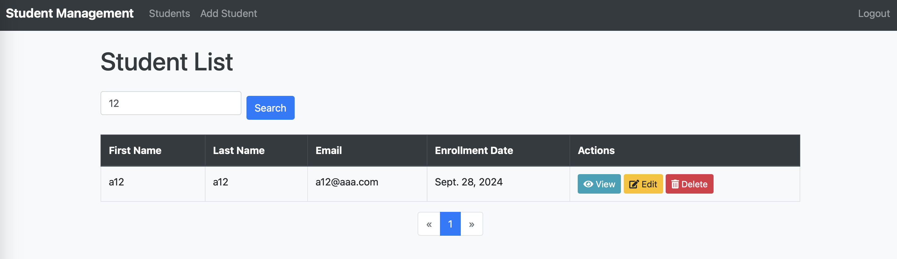

# Student Management System

A web-based application built with Django that allows users to manage student records. The system supports functionalities like adding, editing, deleting, searching, and paginating student data, along with user authentication and custom error handling.

---

## Table of Contents

- [Introduction](#introduction)
- [Setup Instructions](#setup-instructions)
  - [Prerequisites](#prerequisites)
  - [Installation Steps](#installation-steps)
- [Features](#features)
- [Challenges Encountered](#challenges-encountered)
- [Implementation Details](#implementation-details)
  - [Views and Templates](#views-and-templates)
  - [Forms and Validation](#forms-and-validation)
  - [Authentication](#authentication)
  - [Search Functionality](#search-functionality)
  - [Pagination](#pagination)
  - [Error Handling](#error-handling)
  - [Design Enhancements](#design-enhancements)
- [Screenshots](#screenshots)
- [Key Code Snippets](#key-code-snippets)
- [Conclusion](#conclusion)
- [License](#license)
- [Contact](#contact)

---

## Introduction

The **Student Management System** is a Django-based web application designed to simplify the management of student records. It allows users to perform CRUD (Create, Read, Update, Delete) operations, search for students, and navigate through records with pagination. The application also includes user authentication to protect sensitive operations and custom error pages for a better user experience.

---

## Setup Instructions

### Prerequisites

- Python 3.x
- pip
- Virtual environment tool (optional but recommended)
- Git (to clone the repository)

### Installation Steps

1. **Clone the Repository:**

   ```bash
   git clone https://github.com/zewei-wang/student_management.git
   cd student-management
   ```

2. **Create and Activate a Virtual Environment:**

   ```bash
   python -m venv venv
   # Windows
   venv\Scripts\activate
   # macOS/Linux
   source venv/bin/activate
   ```

3. **Install Dependencies:**

   ```bash
   pip install -r requirements.txt
   ```

4. **Apply Migrations:**

   ```bash
   python manage.py migrate
   ```

5. **Create a Superuser:**

   ```bash
   python manage.py createsuperuser
   ```

6. **Run the Development Server:**

   ```bash
   python manage.py runserver
   ```

7. **Access the Application:**

   Open your browser and navigate to `http://127.0.0.1:8000/`.

---

## Features

- **Student CRUD Operations:** Add, view, edit, and delete student records.
- **User Authentication:** Secure login and logout functionalities to protect sensitive operations.
- **Search Functionality:** Search for students by first or last name.
- **Pagination:** Display student records in a paginated format.
- **Form Validation:** Validate user input for email and grade fields.
- **Error Handling:** Custom 404 and 500 error pages.
- **Responsive Design:** Enhanced user interface using Bootstrap for a modern look.
- **Flash Messages:** Inform users of successful actions or errors using Bootstrap alerts.

---

## Challenges Encountered

- **Static Files Handling:** Encountered issues with serving static files when `DEBUG` was set to `False`. Resolved by correctly setting `STATIC_ROOT` and configuring `urls.py` to serve static files during development.
- **Custom 404 Page Not Displaying:** The custom 404 page wasn't working after redesigning. Fixed by ensuring `DEBUG = False`, adding the appropriate templates directory, and configuring `ALLOWED_HOSTS`.
- **Form Validation:** Implementing custom validation for the email and grade fields required understanding Django's form validation mechanisms.
- **Integrating Bootstrap:** Adjusting templates to utilize Bootstrap components while maintaining functionality posed some challenges but significantly improved the UI.
- **Authentication Flow:** Ensuring that only authenticated users could access certain views required careful application of the `@login_required` decorator and proper redirection after login/logout.

---

## Implementation Details

### Views and Templates

Implemented function-based views for handling student data. Utilized Django's template inheritance to create a base template (`base.html`) and extend it for other pages, ensuring a consistent look and feel across the application.

**Key Code Snippet:**

```python
# students/views.py
from django.shortcuts import render, get_object_or_404, redirect
from .models import Student
from .forms import StudentForm
from django.contrib.auth.decorators import login_required

def student_list(request):
    # View logic
```

### Forms and Validation

Created `StudentForm` using `forms.ModelForm` and added custom validation methods for the email and grade fields to ensure data integrity.

**Key Code Snippet:**

```python
# students/forms.py
from django import forms
from .models import Student

class StudentForm(forms.ModelForm):
    class Meta:
        model = Student
        fields = '__all__'

    def clean_email(self):
        email = self.cleaned_data.get('email')
        pattern = r'^[\w\.-]+@[\w\.-]+\.\w+$'
        if re.match(pattern, email):
            return email
        raise forms.ValidationError('Invalid email address')

    def clean_grade(self):
        grade = self.cleaned_data.get('grade')
        if not 1 <= grade <= 10:
            raise forms.ValidationError('Grade must be between 1 and 10.')
        return grade
```

### Authentication

Used Django's built-in authentication system to restrict access to certain views. Applied the `@login_required` decorator to protect the add, edit, and delete views, ensuring only authenticated users can perform these actions.

**Key Code Snippet:**

```python
# students/views.py
from django.contrib.auth.decorators import login_required

@login_required
def student_add(request):
    # View logic for adding a student

@login_required
def student_edit(request, pk):
    # View logic for editing a student

@login_required
def student_delete(request, pk):
    # View logic for deleting a student
```

### Search Functionality

Added a search form to the student list page and modified the view to filter results based on the query, allowing users to search for students by first or last name.

**Key Code Snippet:**

```python
# students/views.py
from django.db.models import Q

def student_list(request):
    query = request.GET.get('q')
    student_list = Student.objects.all()
    if query:
        student_list = student_list.filter(
            Q(first_name__icontains=query) | Q(last_name__icontains=query)
        )
    # Pagination logic
```

### Pagination

Implemented pagination using Django's `Paginator` class to limit the number of students displayed per page, improving the user experience when dealing with large datasets.

**Key Code Snippet:**

```python
# students/views.py
from django.core.paginator import Paginator

def student_list(request):
    # ... search logic ...
    paginator = Paginator(student_list, 10)  # Show 10 students per page
    page_number = request.GET.get('page')
    students = paginator.get_page(page_number)
    # Render the template with the students context
```

### Error Handling

Created custom `404.html` and `500.html` templates and ensured they are displayed when appropriate by setting `DEBUG = False` and configuring `ALLOWED_HOSTS`.

**Key Code Snippet:**

```html
<!-- templates/404.html -->




<div class="text-center">
    <h1>Page Not Found (404)</h1>
    <p>The page you are looking for does not exist.</p>
    <a href="" class="btn btn-primary">Go to Home Page</a>
</div>

```

### Design Enhancements

Integrated Bootstrap and Font Awesome to enhance the website's appearance, making it responsive and more user-friendly. Customized templates to utilize Bootstrap components and styles.

**Key Code Snippet:**

```html
<!-- base.html -->

<!DOCTYPE html>
<html lang="en">
<head>
    <!-- ... -->
    <!-- Bootstrap CSS -->
    <link rel="stylesheet" href="https://stackpath.bootstrapcdn.com/bootstrap/4.5.2/css/bootstrap.min.css">
    <!-- Font Awesome CSS -->
    <link rel="stylesheet" href="https://cdnjs.cloudflare.com/ajax/libs/font-awesome/5.15.1/css/all.min.css">
    <!-- Custom CSS -->
    <link rel="stylesheet" href="">
</head>
<!-- ... -->
```

---

## Screenshots

### Student List Page


### Student Detail Page


### Add/Edit Student Form


### Login Page


### Search Student



### 404 Error


---

## Key Code Snippets

### Custom Template Filter to Add CSS Classes to Form Fields

Used a custom template filter to add Bootstrap classes to form fields for consistent styling.

```python
# students/templatetags/form_tags.py
from django import template

register = template.Library()

@register.filter(name='add_class')
def add_class(value, arg):
    return value.as_widget(attrs={'class': arg})
```

### Pagination Controls in Template

Implemented pagination controls in the `student_list.html` template using Bootstrap's pagination component.

```html
<!-- student_list.html -->
<nav aria-label="Page navigation">
    <ul class="pagination justify-content-center">
        
            <li class="page-item">
                <a class="page-link" href="?page={{ students.previous_page_number }}">&laquo;</a>
            </li>
        
            <li class="page-item disabled">
                <span class="page-link">&laquo;</span>
            </li>
        

        
            
                <li class="page-item active">
                    <span class="page-link">{{ num }}</span>
                </li>
            
                <li class="page-item">
                    <a class="page-link" href="?page={{ num }}">{{ num }}</a>
                </li>
            
        

        
            <li class="page-item">
                <a class="page-link" href="?page={{ students.next_page_number }}">&raquo;</a>
            </li>
        
            <li class="page-item disabled">
                <span class="page-link">&raquo;</span>
            </li>
        
    </ul>
</nav>
```

### Handling Static Files in `settings.py`

Configured `STATIC_URL`, `STATICFILES_DIRS`, and `STATIC_ROOT` to correctly serve static files.

```python
# settings.py
import os

BASE_DIR = os.path.dirname(os.path.dirname(os.path.abspath(__file__)))

STATIC_URL = '/static/'

STATICFILES_DIRS = [
    os.path.join(BASE_DIR, 'static'),
]

STATIC_ROOT = os.path.join(BASE_DIR, 'staticfiles')
```

### Custom 404 Error View

Ensured the custom 404 page is displayed by placing `404.html` in the correct directory and setting `DEBUG = False`.

```python
# settings.py
DEBUG = False
ALLOWED_HOSTS = ['localhost', '127.0.0.1']
```

---

## Conclusion

Developing the Student Management System was an insightful experience that deepened my understanding of Django's capabilities. Integrating various features like authentication, search, and pagination required careful planning and debugging. The challenges faced, especially with static files and error handling, enhanced my problem-solving skills. The design enhancements using Bootstrap significantly improved the user interface and user experience.

Moving forward, I plan to implement user roles and permissions to further secure the application and possibly add more features like student performance tracking and reporting.

---

## License

This project is licensed under the MIT License - see the [LICENSE](LICENSE) file for details.

---

## Contact

**Zewei Wang**

- **Email:** zwang019@uottawa.ca

Feel free to contact me if you have any questions or suggestions regarding this project.

---